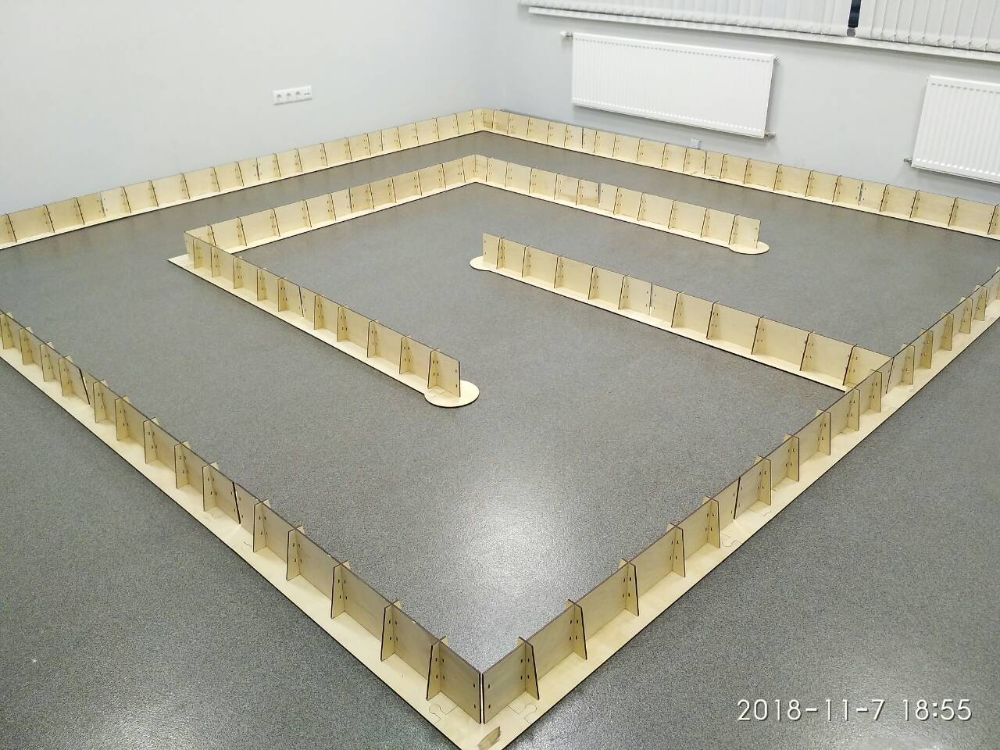
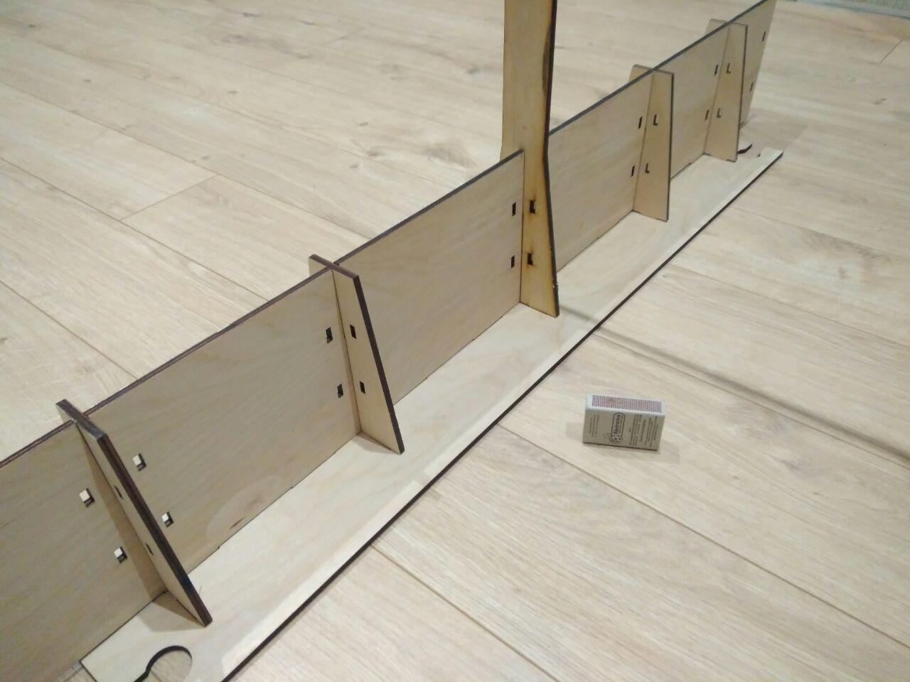

# 2. Трасса

Трасса (Рис. 1) - поверхность ограниченная бортами (Рис. 2).

  

Рис.1 – Пример трассы

На рисунке 2 изображен пример борта трассы.

Рис.2 – Пример борта трассы

## Требования к размерам трассы:
- ширина трассы 950 - 1300 мм;
- ширина трассы в повороте 950 - 1750 мм;
- борта расположены на краях трассы, высота борта 100 - 200 мм;

## Эстакада

На трассе может быть расположена эстакада, подъем и спуск которой должны иметь угол от горизонта не более чем 20° (Роботы должны иметь возможность преодолевать эстакаду).

Покрытие трассы и борта могут быть использованы для нанесения рекламных изображений.
