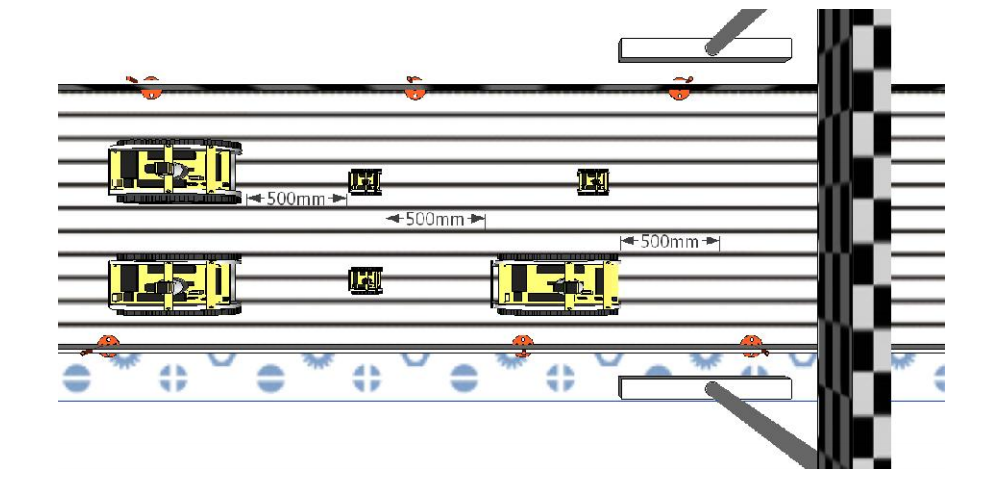

# 4. Заезды

Заезды бывают трех типов: квалификационные, отборочные, финальные.

Квалификационные - заезд выполняется при сертификации робота.

Задача: проехать один круг трассы, при этом возможно использование препятствий для проверки антиколизацийнои системы 
робота. Старт и остановка осуществляется по сигналу судьи, который воспринимается роботом через стартовое устройство. 
Количество попыток не ограничено и может осуществляться до начала последнего отборочного заезда.

Отборочные - заезд выполняется в общем зачете отборочного тура.

Задача: проехать определенное количество кругов, регламентировано 2 Пунтом Технического задания для отборочных заездов. 
Старт и остановка осуществляется по сигналу судьи, который воспринимается роботом через стартовое устройство. Роботу 
разрешено участвовать только в одном отборочном заезде.

Финальные - заезд выполняется по результатам общего отборочного зачете тура.

Задача: проехать определенное количество кругов, регламентировано 2 пунктом Технического задания для финальных заездов. 
Старт и остановка осуществляется по сигналу судьи, который воспринимается роботом через стартовое устройство.

## 4.1. Подготовка к заезду

Схема размещения роботов в начале каждого заезда показана на Рис. 9. У внутреннего борта размещаются четные номера, а у 
внешнего - нечетные номера роботов в заезде.

Рис.9 – Схема размещения роботов перед началом заезда

Перед началом очередного заезда у каждой команды есть 5 минут, чтобы подготовить робота(ов) к работе на игровом поле. 
Робот, который не готов к работе по истечении 5 минут, дисквалифицируется с заезда. Когда команды приготовили своих 
роботов, судья раз спрашивает участников об их готовности и проводит обратный отсчет и старт заезда.

## 4.2. Ход заезда

После того, как судья даст стартовый сигнал, робот должен быть активирован. При каких обстоятельствах не разрешается 
толкать или поправлять роботов, однако команда и только команда может где угодно и когда угодно в течение заезда снять 
своего робота для устранения неисправностей. Устранять неисправности любого типа разрешено только на пит-стопе команды, 
то есть робот должен после его изъятия с трассы течение заезда обязательно коснуться своим шасси специальной зоны на 
пит-стопе (Рис. 10).

Рис. 10 – Пример стола для пит-стопа команды

* После пит-стопа робот может быть возвращен в заезд из зоны старта. 
* Любые внешние действие участников на робота другой команды может привести к дисквалификации команды из заезда.
* В течение заезда разрешено вносить изменения в конструкцию в пределах разрешенного размера.
* Подсчет пройденных кругов и времени осуществляет электронная система, при ее отсутствии эту операцию осуществляют 
судьи. 
* Каждая команда имеет право дублировать подсчет кругов и времени своего робота.
* На протяжении всего заезда осуществляется видеозапись, который используется для разрешения споров.
* Главный судья имеет право остановить заезд: при выявлении нарушений регламента, по общему согласию участников заезда.
* После выполнения задания, то есть полного прохождения роботом определенного количества кругов, судьи останавливают 
секундомер и фиксируют затраченное время. Затем судьи объявляют результат каждого робота в заезде. Если команды согласны 
с результатами, они подписывают протокол и только после этого могут забрать своих роботов с игрового поля. Если команды 
с чем-то не согласны, то они могут обсудить спорные моменты. Роботы продолжают оставаться на своих местах до окончания 
спора. В итоге главный судья выносит окончательное решение. В случае, если найти решение в обсуждении не удается, 
главный судья оставляет за собой решение о переигровке заезда.
* Если команда не прошла установленное количество кругов в течение заезда, она выбывает из отборочного зачете тура.
* Команда объявляется дисквалифицированной с заезда, если ни один из роботов команды полностью не покинул стартовой зоны 
течение заезда, или если главный судья вынесет соответствующее решение по итогам матча указав на причины 
дисквалификации.

## 4.3. Система баллов

По окончании тура каждой команде начисляется сумма баллов по таблице 1, Таблица 1 – Шкала начисления баллов в заезде

| № | Тип процедуры               | Количество баллов |
| - | --------------------------- |:-----------------:|
| 1 | Проходженне клалификации    | 1                 |
| 2 | Участие в отборочном заезде | 1                 |
| 3 | Участие в финальном заезде  | 1                 |
| 4 | Занятое ІІІ место в финале  | 1                 |
| 5 | Занятое ІІ место в финале   | 2                 |
| 6 | Занятое І место в финале    | 3                 |

Команда, набравшая протяжении тура наибольшее количество баллов, считается победителем тура.

Команда, набравшая протяжении всех туров сезона наибольшее количество баллов, считается победителем сезона.

## 4.4. Дисквалификация

Дисквалификационная ситуация рассматривается как несоблюдение правил: такая ситуация должна оставаться исключительной! 
В случае повторяющихся нарушений, судьи имеют право дисквалифицировать команду в туре.
